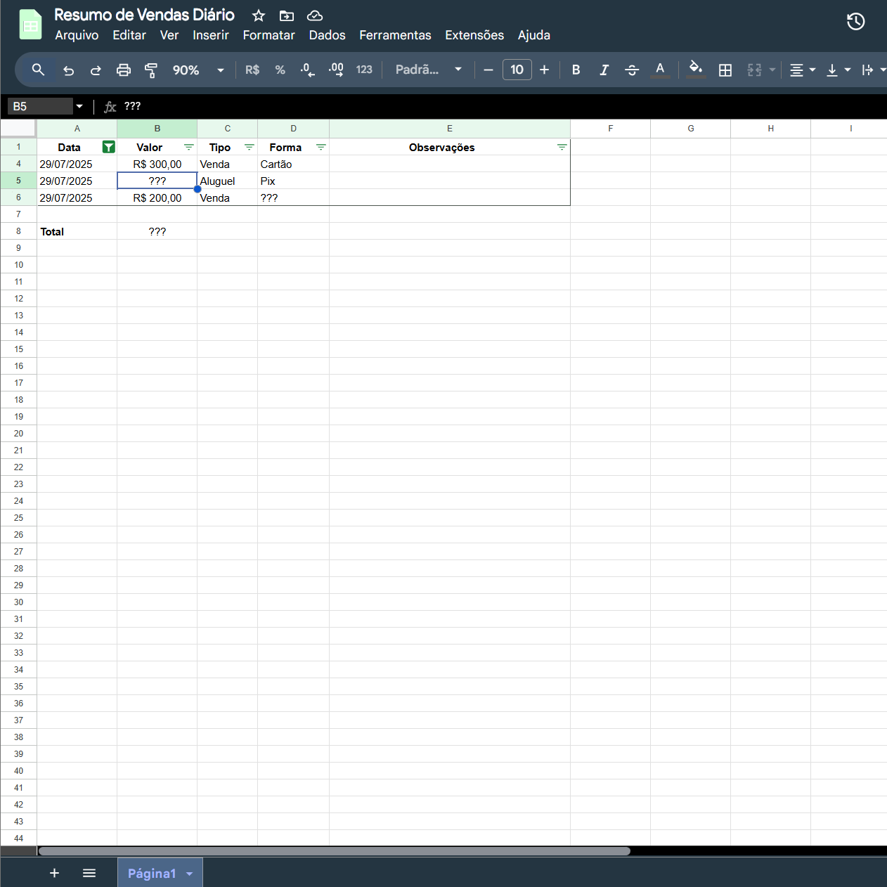
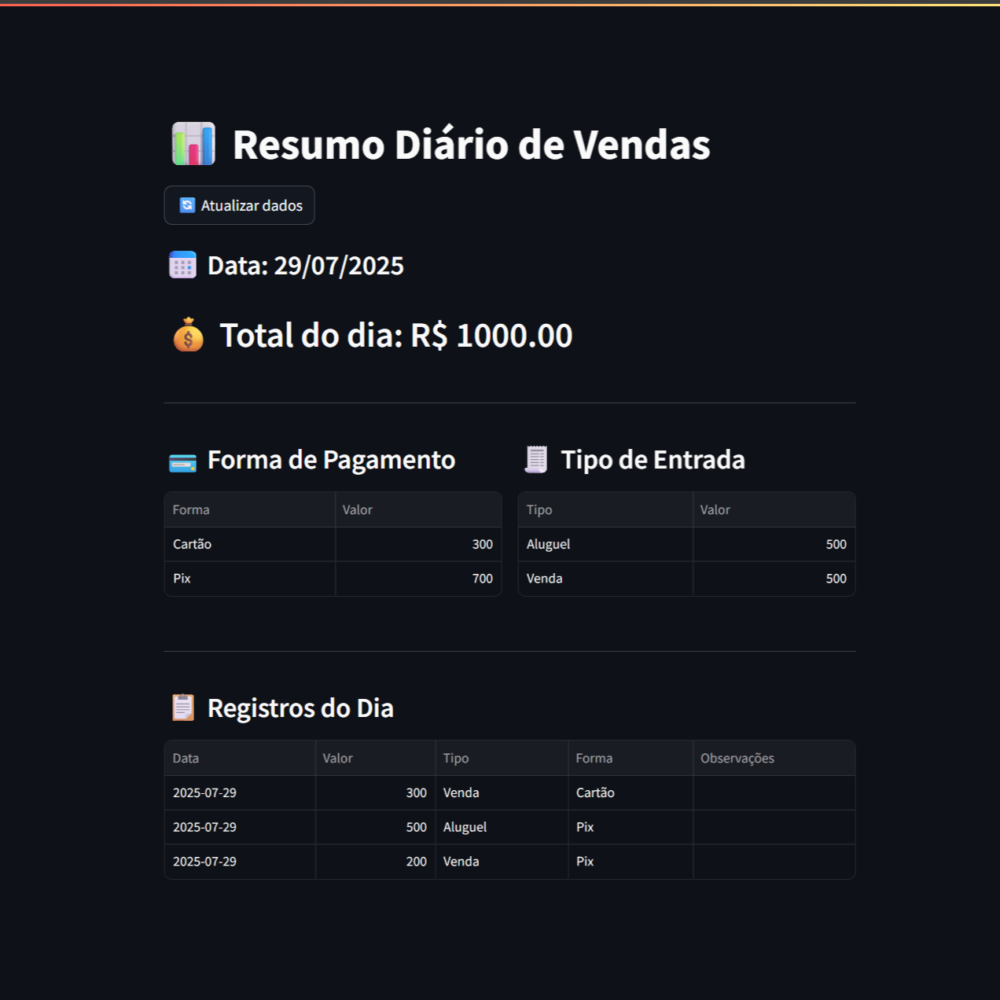

# Resumo Diário de Vendas

Automação simples e funcional que gera um resumo diário de vendas diretamente a partir de uma planilha no Google Sheets, exibido em uma interface limpa com Streamlit.

---

## Objetivo

Evitar o retrabalho manual de calcular totais no fim do dia e gerar clareza imediata para o dono do negócio — em segundos, ele já sabe:

- Total faturado no dia
- Valor por forma de pagamento (PIX, cartão, etc)
- Valor por tipo de entrada (venda, aluguel, serviço, etc)
- Todos os registros lançados naquele dia

---

## Tecnologias usadas

- Python
- Streamlit
- Pandas
- gspread
- Google Sheets API

---

## Antes e Depois

Antes
 

Depois


---

## Como rodar localmente

1. Clone este repositório:
2. Instale as dependências:
   ```bash
   pip install -r requirements.txt
3. Crie um arquivo creds.json com as credenciais da sua conta de serviço do Google
4. Compartilhe sua planilha com o e-mail da conta de serviço
5. Rode a aplicação:
   ```bash
   streamlit run main.py

## Observações

- A planilha deve conter as seguintes colunas: Data, Valor, Tipo, Forma, Observações
- A data deve estar no formato dd/mm/aaaa (ex: 29/07/2025)
- Os valores podem estar no formato brasileiro (ex: R$ 1.200,00) — o script já converte

## Versão Online (opcional)
Se quiser testar online, pode rodar gratuitamente via Streamlit Cloud e compartilhar um link com clientes.

##Segurança
Este projeto não inclui nenhuma chave ou credencial sensível.
O arquivo creds.json foi adicionado ao .gitignore e deve ser gerado manualmente por cada usuário.
